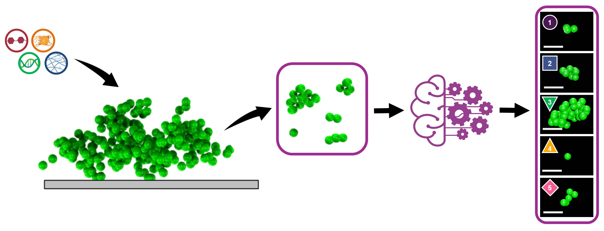

# *Staphylococcus epidermidis* Detached Cell Cluster Phenotypes

Welcome to the repository for the *Staphylococcus epidermidis* detached cell cluster phenotypes project! This workflow contains the pipeline for 3D biophysical image analysis and phenotype clustering.

## Associated Publication

This workflow is used for image analysis in the following peer-reviewed manuscript: 
        
> Packard, S. R., Bulacan, G., Peiris, B., Paffenroth, R., and Stewart, E.J. **“Biophysical properties and phenotypes of cell clusters detached from *Staphylococcus epidermidis* biofilms after matrix-targeted disruption.”** *Colloids and Surfaces B: Biointerfaces*. (2026). [https://doi.org/10.1016/j.colsurfb.2026.115620](https://doi.org/10.1016/j.colsurfb.2026.115620)

*Note: Image files are available upon request. Please email ejstewart@wpi.edu to request the raw datasets.*

---

## Image Processing Pipeline

The original microscopy image files are `.LIF` 3D stacks. 

1. **Extraction:** An ImageJ macro script (located in the `scripts/` directory) is used to iteratively save each plane of the `.LIF` files into separate folders of `.tiff` images for each image volume. *(If you need to download ImageJ/Fiji, you can find it [here](https://imagej.net/downloads)).*
   * *Data Structure:* There are 20 image volumes per `.LIF` file. Each image volume is named sequentially `WXSY` with `X = [1, 2, 3, 4]` and `Y = [1, 2, 3, 4, 5]`. `W` corresponds to the well (from an 8-well chambered coverglass dish) the image was taken in, and `S` indicates the sample within that well.
2. **Analysis:** The Python Jupyter notebooks read the `.tiff` file stacks from these folders. *(Note: The notebook will need to be updated to match your local file paths).*
3. **Visualization:** Blender scripts are used to create 3D renderings of cell clusters from the 3D coordinates of cell centroids identified by the Python scripts. Included is a Python script that automatically searches for cell clusters fitting specific criteria (e.g., the approximate physical properties of each k-means phenotype).

---

## Core Dependencies and References

The Python analysis scripts rely heavily on the following foundational libraries:
        
1. **Trackpy:** Allan, D. B., Caswell, Thomas, Keim, Nathan C.,  van der Wel, Casper M.,  Verweji, Ruben W. soft-matter/trackpy: Trackpy v0.5.0 (v0.5.0). 2021. DOI: [10.5281/zenodo.4682814](https://doi.org/10.5281/zenodo.4682814).
2. **Particle Identification Method:** Crocker, J. C.; Grier, D. G. Methods of Digital Video Microscopy for Colloidal Studies. *Journal of Colloid and Interface Science* 1996, 179 (1), 298–310. DOI: [10.1006/jcis.1996.0217](https://doi.org/10.1006/jcis.1996.0217).
3. **Freud:** Ramasubramani, V.; Dice, B. D.; Harper, E. S.; Spellings, M. P.; Anderson, J. A.; Glotzer, S. C. freud: A software suite for high throughput analysis of particle simulation data. *Computer Physics Communications* 2020, 254, 107275. DOI: [10.1016/j.cpc.2020.107275](https://doi.org/10.1016/j.cpc.2020.107275)
4. **Scikit-Learn:** Pedregosa, F.; Varoquaux, G.; Gramfort, A.; Michel, V.; Thirion, B.; Grisel, O.; Blondel, M.; Prettenhofer, P.; Weiss, R.; Dubourg, V.; et al. Scikit-learn: Machine Learning in Python. *Journal of Machine Learning Research* 2011, 12, 2825––2830.
